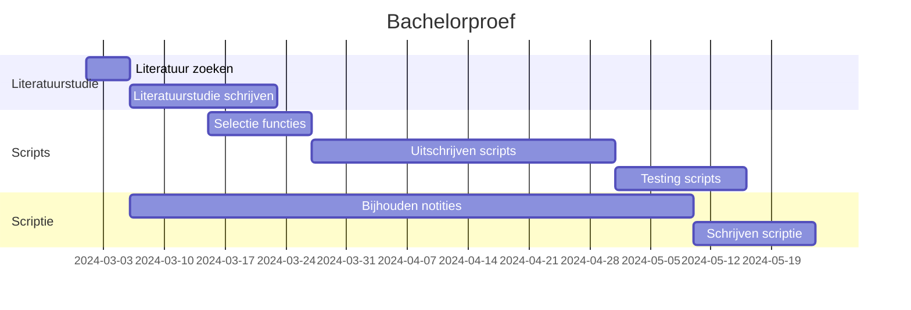

# Scripting voor Netwerkoptimalisatie: DNS en DHCP Beheer met Python-scripts en IP Address Management Integratie

## 1. Abstract
Deze bachelorproef richt zich op het ontwikkelen van een innovatieve benadering voor netwerkbeheer door middel van Python-scripts. 
Het hoofddoel is het creëren van een abstractielaag boven een bestaande netwerkbeheer tool voor DNS en DHCP, 
waarbij de API van een IP Address Management (IPAM)-tool wordt aangestuurd. 
Deze abstractielaag maakt interactie met de IPAM-tool mogelijk via Python-scripts en wordt geoptimaliseerd door API-aanroepen vanuit een intuïtief webportaal. 
Het doel is om de complexiteit van het handmatig beheren van netwerkconfiguraties, inclusief IP-adresallocatie, te verminderen, waardoor efficiëntie en gebruiksvriendelijkheid worden verbeterd.

## 2. Inleiding
Internet Protocol (IP) is het fundament van elk gestructureerd, goed functionerend en veilig netwerk. IP is een set regels en procedures die apparaten op netwerken adresseert met unieke numerieke identificaties. Dit geeft de mogelijkheid efficiënt gegevens te routeren, netwerken te verdelen in meer beheersbare eenheden, toegang te beperken tot gevoelige data of systemen, services te identificeren en het oplossen van netwerkproblemen [RFC791](https://www.rfc-editor.org/rfc/rfc791). Dit hoofdstuk legt via DNS en DHCP de basis van uit voor het beheren van IP netwerken. 

### 2.1 Veelgebruikte protocols
Binnen het domein van IT Netwerkbeheer zijn er twee kritische protocols: 
- **Domain Name System (DNS)**: Dit is een systeem die via *resource records* onder andere vertalingen voorziet tussen domeinnamen en IP adressen [RFC1034](https://www.rfc-editor.org/rfc/rfc1034). Als voorbeeld kan je via de browser naar google surfen via het IP adres *142.251.36.35* of via de domeinnaam *www.google.be*.
- **Dynamic Host Configuration Protocol (DHCP)**: Dit protocol voorziet een framework voor het doorgeven van configuratie informatie naar hosts (lees: computers) op het netwerk [RFC2131](https://datatracker.ietf.org/doc/html/rfc2131). Zo kan een computer bijvoorbeeld een IP adres ontvangen waarmee die kan communiceren binnen het netwerk waarop die is aangesloten.
  
#### 2.1.1 DNS
DNS voorziet meerdere types resource records die netwerkbeheerders kunnen meegeven: 
  - **A**: Dit beschrijft een host adres. Vb. *"server1.voorbeeld.com IN A 192.168.1.1"* maakt de vertaling zodat het toestel met de naam server1.voorbeeld.com bereikbaar is zowel via het IP adres 192.168.1.1 als via de domeinnaam. 
  - **CNAME**: Dit beschrijft de kanonieke naam van een host, het wordt gebruikt om een alias of subdomein naar het hoofddomein door te verwijzen. Vb. *"www.voorbeeld.com. IN CNAME server1.voorbeeld.com"* zorgt dat server1 ook bereikbaar is via "www.voorbeeld.com".
  - **MX**: Dit is een *mail exchange* record en wordt gebruikt om aan te geven welke mailservers verantwoordelijk zijn voor het ontvangen van mails binnen een domein. vb. *"voorbeeld.com. IN MX 10 mailserver.voorbeeld.com"* geeft de DNS server mee welke server de mailserver is.
  - **NS**: Dit is een *name server* record, het beschrijft welke DNS servers verantwoordelijk zijn voor het beheren van DNS informatie voor een domein. Vb. *"voorbeeld.com IN NS dns1.voorbeeld.com"* verwijst naar dns1 als DNS server voor het domein voorbeeld.com.
  - **PTR**: Dit is een *Pointer* record, het wordt gebruikt om via IP een vertaling te vragen aan de DNS server in plaats van via de naam.
  - **SOA**: Dit is een *Start of Authority* record die belangrijke informatie bevat over de zone, zoals welke de primaire DNS server, contactpersonen, etc.
[RFC1034](https://www.rfc-editor.org/rfc/rfc1034)

#### 2.1.2 DHCP
IP netwerken worden door netwerkbeheerders op een logische manier opgesplitst in subnetwerken. Hierbij worden de beschikbare IP adressen verdeeld in sub-netwerken (subnet). Toestellen binnen subnet A zullen elkaar kunnen bereiken terwijl een toestel in een subnet B zonder de nodige routering geen verbinding zal kunnen maken met de toestellen in subnet A.
Voor DHCP zullen netwerkbeheerders subnets (of pools van IP adressen) aanbieden aan de DHCP server. De DHCP server uit deze pools (onder andere) IP adressen uitdelen aan toestellen die verbinden op het netwerk en daarbij de DHCP server laten weten dat ze nog geen IP adres hebben.
DHCP beschrijft 3 mechanismes voor het uitdelen van IP adressen:
- **Automatisch toewijzen**: Permanent toewijzen van een IP adres.
- **Dynamisch toewijzen**: IP adres voor een bepaalde tijd toewijzen.
- **Manueel toewijzen**: Een (door de netwerkbeheerder) vooraf bepaald IP adres toewijzen, in vakjargon noemt met dit een IP reservatie.
[RFC2131](https://datatracker.ietf.org/doc/html/rfc2131)

#### 2.2 IPAM
Naast de vele uitdagingen die zowel DNS als DHCP met zich meebrengen is het beheren van de vele DNS records, IP adres ranges en de vaak vele IP reservaties zeker iets waar een netwerkbeheerder over moet waken. 
Een mogelijke oplossing hiervoor is het gebruiken van IP Address Management (IPAM) via softwarepakketten die IPAM aanbieden.
IPAM laat toe IP adressen efficiënt te beheren in een netwerk, het geeft een gestructureerde aanpak waardoor conflicten tussen subnetten worden vermeden. Het geeft een overzicht van alle subnetten met wat beschikbaar is en wat in gebruik is. IPAM geeft eveneens de mogelijkheid om de historiek bij te houden waardoor het van pas komt voor schaalbaarheid en beveiliging van het netwerk.

## 3. Probleemstelling
Deze bachelorproef zal uitgevoerd worden bij Universiteit Gent (UGent) dienst ICT. Momenteel werkt UGent met scripts die op basis van zo genaamde subnetbestanden de nodige acties uitvoeren op de DHCP en DNS servers. 
Deze subnetbestanden stellen elk 1 subnet voor en beschrijven cruciale informatie zoals DNS servers, welk *Virtual Local Area Network* (VLAN) nummer, gateway, etc. Hiernaast bevatten deze ook alle beschikbare, vrije IP adressen, als alle gereserveerde adressen met daarbij eventueel enkele regels voor DNS en beveiliging.
Voor elke IP reservatie die moet gebeuren krijgt het netwerk team van interne UGent personeel een mail met daarin de nodige hostinformatie die ze in het daarvoor bestemde subnetbestand plakken. Indien hier nog extra DNS of beveiligingsregels bij horen, moet de netwerkbeheerder deze er zelf nog bijschrijven.
Het overzicht van de beschikbare IP ranges is beschreven in een intern wikipediapagina met daarbij de beschrijving van elke range. Deze brengt meerdere uitdagingen met zich mee:
- **Tijd**: Het onderhouden van de scripts, subnetbestanden, IP reservaties (maken en opkuisen) kan veel tijd vragen.
- **Schaalbaarheid**: Er is weinig historische data waardoor men moeilijk trends kan herkennen, ook wikipedia pagina's moet men manueel bijwerken bij wijzigingen.
- **Consistentie**: De huidige aanpak vraagt meerdere manuele acties wat vatbaar is voor menselijke fouten of vergissingen.  
- **Beveiliging**: Ook hier heeft het gebrek aan historische data impact. **deze uitdaging snap i kniet**

UGent is momenteel stappen aan het ondernemen voor het implementeren van Efficiënt IP (EIP), een IPAM-softwarepakket, in hun opzet. Dankzij deze implementatie is de verwachting dat de hierboven beschreven indicatoren zullen verbeteren.

## 4. Doelstelling van de Bachelorproef
Deze bachelorproef zal een abstractielaag maken boven EIP waarbij python scripts via de *application programming interface* (API) van EIP commando's zullen uitvoeren op EIP.
Door de omvang van het EIP-project is het niet haalbaar om UGent volledig over te zetten op de werking van EIP. Aangezien dit kritische componenten zijn, zal elke stap in de migratie naar EIP eerst uitvoerig getest worden voordat deze in productie gaat.
Daarom stel ik als doel om een eerste versie op te leveren van een webportaal waarop men reeds meerdere IP reservaties kan aanmaken, wijzigen of verwijderen. Netwerkbeheerders zullen in deze eerste versie de mogelijkheid hebben om een overzicht te krijgen van alle openstaande aanvragen en deze al dan niet goed te keuren.

## 5. Methodiek
Binnen UGent zijn er reeds eerste stappen ondernomen voor het implementeren van EIP, deze stappen zijn:
 - Testen van de mogelijkheden van Efficiënt IP
 - Inlezen in documentatie
 - Schrijven van Python scripts:
   - Uploaden van UGent Subnet bestanden naar EIP
   - Uitlezen van EIP en maken van UGent Subnet bestanden.

### 5.1 Gebruikte software
De scripts voor deze bachelorproef zijn (**worden?)** geschreven in **Python3** via **Visual studio code**. Voor het testen van de API methodes wordt gebruik gemaakt van **Postman**.

### 5.2 Methodiek scripts
Voordat een script wordt geschreven, worden eerst testen gedaan via Postman en het webportaal van EIP. Hierbij worden de API methodes getest. Eens deze testen succesvol zijn, wordt er overgegaan tot het implementeren van de API methode in Python scripts.

### 5.3 Tijdslijn Bachelorproef
Voor het uitvoeren van de bachelorproef wordt er eerst een literatuurstudie uitgevoerd waarbij gericht gezocht zal worden naar gelijkaardige implementaties van webapplicaties die via scripts samenwerken met API's van toepassingen. 

## 6. Conclusie
Dankzij het implementeren van de python abstractielaag in deze versie kan Universiteit Gent eenvoudig, consistent, en snel IP reservaties beheren. 
